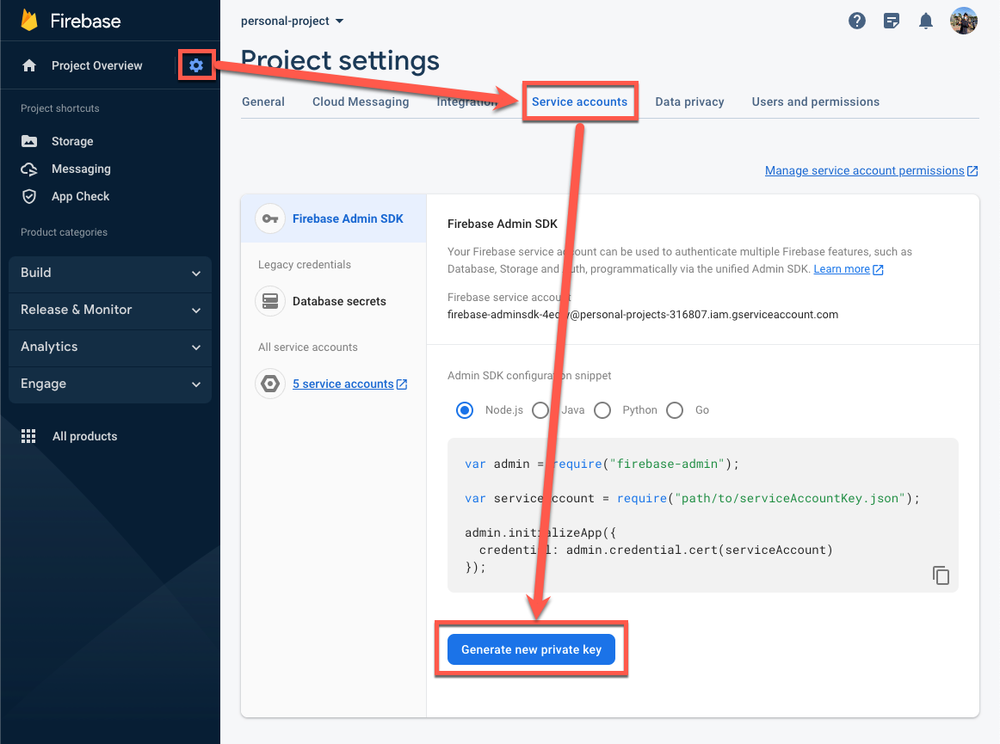

# NestJS + Next.js Firebase Cloud Messaging Push Notifications

Summary: this repository contains complete integration of Firebase Cloud Messaging and the web client using Next.js

## Prerequisite

- [Firebase](https://firebase.google.com/) Account
- Node.js v18+
- Some fundamentals knowledge of [NestJS](https://nestjs.com/) and [Next.js](https://nextjs.org/)
- [pnpm](https://pnpm.io/) or any desired package management

## Dev Environment Setup

### Setup Firebase

1. Go to [Firebase Console](https://console.firebase.google.com/).
2. Add a new project or select existing project
3. On the top left navigation menu, click the cog button then click the "Project settings" link.
4. On the project settings page, navigate the tab control to "Service accounts".
   
5. Click the "Generate new private key" button.
6. The dialog will show and save the file.
   We will use some of these keys later.

### Setup API Environment Keys

After finished setup Firebase project and get private key file.
We will select those keys and inject to our environment file.

1. Open the recently loaded private key file.
2. Go to the `apps/api` folder.
3. Copy the `.env.example` to `.env`
4. Replacing these keys:
   ```bash
   FIREBASE_CLIENT_EMAIL=<YOUR_CLIENT_EMAIL>
   FIREBASE_PRIVATE_KEY=<YOUR_PRIVATE_KEY>
   FIREBASE_PROJECT_ID=<YOUR_FIREBASE_PROJECT>
   ```
5. Save the file and restart the api server via:
   ```bash
   $ pnpm --filter api run start:dev
   # or 
   $ cd apps/api
   $ pnpm run start:dev
   ```
6. The API will start without any error.
